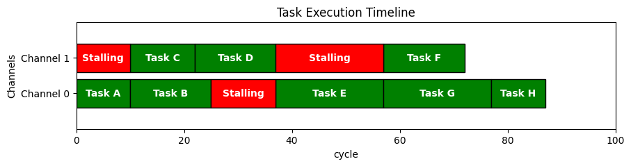

# Profile tools

## Overview
This task_profile is a Python-based tool designed to model and analyze task execution in a multi-channel pipeline environment. It's particularly useful for understanding task dependencies, blocking behaviors, and overall pipeline efficiency.

## Features
- Simulate task execution across multiple channels
- Model blocking and non-blocking tasks
- Calculate and visualize task stall times
- Identify the critical path in the pipeline
- Generate visual representations of the pipeline execution

## Requirements
- Python 3.x
- pandas
- matplotlib

## Installation
1. Clone this repository or download the source code.
2. Install the required dependencies:
   ```
   pip install pandas matplotlib
   ```

## Usage

### Defining Tasks
Tasks are defined using the `TaskProfile` class. Each task has the following properties:
- `task_id`: Unique identifier for the task
- `task_name`: Name of the task
- `channel_id`: The channel on which the task runs
- `latency`: Execution time of the task
- `blocking`: Whether the task blocks other channels
- `blocked_channels`: List of channels blocked by this task

Example:
```python
task = TaskProfile(1, "Task A", channel_id=0, latency=10, blocking=True, blocked_channels=[1])
```

### Running the Simulation
```
python task_profile.py
```

## Output
This profile tool provides:
1. Console output with key path, total execution time, and total stall time.
2. A pandas DataFrame with detailed information for each task.
3. A matplotlib visualization of the pipeline execution.




